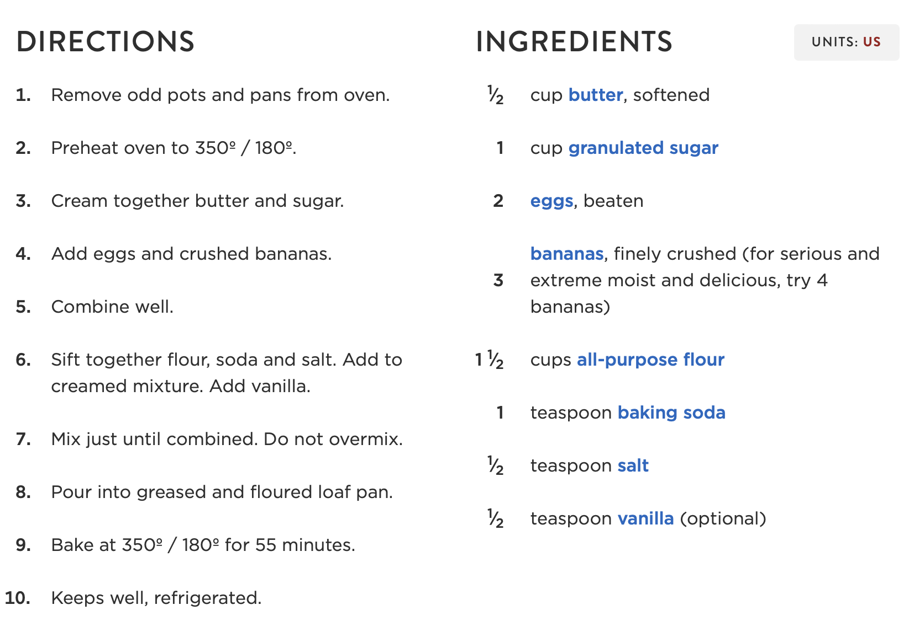

# Banana Bread Recipe
Welcome to my recipe

### About this recipe
This is a Banana Bread recipe that is cited from the internet

## Ingredients
- **1⁄2** cup butter, softened
- **1** cup granulated sugar
- **2** eggs, beaten
- **3** bananas, finely crushed *(for serious and extreme moist and delicious, try 4 bananas)*
- **1 1⁄2** cups all-purpose flour
- **1** teaspoon baking soda
- **1⁄2** teaspoon salt
- **1⁄2** teaspoon vanilla *(optional)*

## Directions
- Remove odd pots and pans from oven.
- Preheat oven to **350º / 180º**.
- Cream together butter and sugar.
- Add eggs and crushed bananas.
- Combine well.
- Sift together flour, soda and salt. Add to creamed mixture. Add vanilla.
- Mix just until combined. *Do not overmix.*
- Pour into greased and floured loaf pan.
- Bake at **350º / 180º** for **55** minutes.
- Keeps well, refrigerated.

**Congratulations!** Now you can enjoy the *delicious* banana bread!

**Thank you for reading!**

